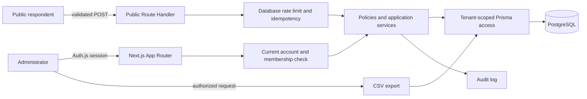

# FeedbackLoop — Customer Feedback Collector

FeedbackLoop is a production-oriented customer feedback application for
collecting anonymous ratings and comments, reviewing and moderating feedback,
managing resolution workflows, analyzing trends, and exporting safe CSV
reports.

## Live preview

**Frontend preview:** [https://viktorkiramman-arch.github.io/customer-feedback-collector/](https://viktorkiramman-arch.github.io/customer-feedback-collector/)

The public GitHub Pages preview is a static product tour. Authentication,
PostgreSQL-backed submissions, moderation, settings, and CSV export are
available in the full application using the local setup below.

## Product capabilities

- Mobile-first public feedback form with business-defined categories
- Administrator authentication and organization-scoped authorization
- Dashboard metrics, recent feedback, rating distribution, and trends
- Search plus rating, category, date, moderation, and workflow filters
- Moderation, priority, resolution state, and resolution notes
- Category creation, archive, and restore
- Public-form status, slug, message, validation, and time-zone settings
- Filter-aware UTF-8 CSV export with spreadsheet-formula protection
- Database-backed rate limiting, idempotency, duplicate detection, and audit logs
- Responsive and accessible public and administrator interfaces
- Prisma migrations and deterministic local demo data
- Vitest, Playwright, and GitHub Actions verification

## Verified URLs

After local setup:

| Workflow | URL |
|---|---|
| Product overview | `http://localhost:3000/` |
| Public feedback form | `http://localhost:3000/f/sample-business-feedback` |
| Administrator login | `http://localhost:3000/login` |
| Dashboard | `http://localhost:3000/admin` |
| Feedback search and filters | `http://localhost:3000/admin/feedback` |
| Categories | `http://localhost:3000/admin/categories` |
| Settings | `http://localhost:3000/admin/settings` |
| CSV export | `http://localhost:3000/admin/export` |
| Health check | `http://localhost:3000/api/health` |

## Stack

- Node.js 22+
- Next.js 16 App Router
- React 19 and TypeScript
- PostgreSQL 17
- Prisma ORM 7 with the PostgreSQL driver adapter
- Auth.js / NextAuth.js 4.24.15
- Tailwind CSS 4
- Zod and React Hook Form
- Vitest and Playwright

## Local setup

### Requirements

- Node.js 22 or newer
- npm
- Docker Desktop or another Docker engine with Compose

### 1. Install exact dependencies

```bash
npm ci
```

`npm ci` uses the committed `package-lock.json` and runs Prisma Client
generation through `postinstall`.

### 2. Configure the local environment

PowerShell:

```powershell
Copy-Item .env.example .env
```

macOS or Linux:

```bash
cp .env.example .env
```

The checked-in example contains disposable localhost values only. Never commit
`.env` or real credentials.

### 3. Start PostgreSQL

```bash
docker compose up -d postgres
docker compose ps
```

The included Compose file exposes PostgreSQL only on
`127.0.0.1:5432`.

### 4. Validate and initialize the database

```bash
npx prisma validate
npm run db:generate
npm run db:deploy
npm run db:seed
```

The seed is intended for local demos. It refuses to run in production unless
`ALLOW_DEMO_SEED=true` is explicitly set, and production seeding requires an
explicit `DEMO_ADMIN_PASSWORD`.

### 5. Start FeedbackLoop

Development:

```bash
npm run dev
```

Production-mode local verification:

```bash
npm run build
npm start
```

Open `http://localhost:3000`.

## Demo credentials

These credentials are created by the default local seed:

- Email: `owner@example.com`
- Password: `ChangeMe123!`

They are shown on the login page only when `DEMO_MODE=true` outside production.
Change them for any shared environment. Never enable demo credential display
or use the example password in production.

## Environment variables

| Variable | Required | Purpose |
|---|---:|---|
| `DATABASE_URL` | Yes | PostgreSQL connection string used by Prisma |
| `NEXTAUTH_SECRET` | Yes | Auth.js token and cookie secret; use at least 32 random characters |
| `NEXTAUTH_URL` | Yes | Canonical application URL, such as `http://localhost:3000` |
| `IP_HASH_SECRET` | Yes | Separate secret used to pseudonymize request identity |
| `TRUST_PROXY_HEADERS` | Yes | `false` by default; set `true` only behind a trusted proxy that overwrites forwarding headers |
| `DEMO_MODE` | Local only | Shows local demo credential hints when `true`; ignored in production |
| `DEMO_ADMIN_EMAIL` | Seed only | Demo administrator email |
| `DEMO_ADMIN_PASSWORD` | Seed only | Demo administrator password |
| `ALLOW_DEMO_SEED` | Production seed only | Explicit opt-in required to run demo seeding in production |
| `POSTGRES_DB` | Compose only | Local database name |
| `POSTGRES_USER` | Compose only | Local database user |
| `POSTGRES_PASSWORD` | Compose only | Local database password |
| `POSTGRES_PORT` | Compose only | Loopback host port for PostgreSQL |

Generate independent production secrets, for example:

```bash
openssl rand -base64 48
```

Do not reuse `NEXTAUTH_SECRET` as `IP_HASH_SECRET`.

## Project Commands

Use these commands for this repository:

- Install: `npm ci`
- Dev: `npm run dev`
- Build: `npm run build`
- Test: `npm test` and `npm run test:e2e`
- Lint: `npm run lint`
- Type-check: `npm run typecheck`
- Format: not configured; keep ESLint clean and follow the existing style

Database commands:

```bash
npm run db:generate  # generate Prisma Client
npm run db:migrate   # create and apply a development migration
npm run db:deploy    # apply committed migrations
npm run db:seed      # create deterministic demo data
npm run db:reset     # destructively reset the configured local database
```

Full verification:

```bash
npm run typecheck
npm run lint
npm test
npm run build
npm run test:e2e
```

Install Playwright's Chromium binary once if it is not already present:

```bash
npx playwright install chromium
```

## Architecture



The database uses a shared schema with an `organizationId` boundary.
Authorization-sensitive reads and writes use the current database membership,
not browser-supplied organization data or only the role embedded at login.
Server Components handle authenticated reads, Server Actions handle
same-application administrator mutations, and Route Handlers handle public
submission, authentication, health, and file download boundaries.

See [ARCHITECTURE.md](./ARCHITECTURE.md) for design decisions.

## Security notes

- Passwords are hashed with bcrypt and never returned to the client.
- Account, membership, role, and organization state is refreshed for protected operations.
- Server-side permissions and organization predicates guard administrator mutations and exports.
- Public input is parsed and validated on the server.
- Rate-limit counters are atomic and database-backed.
- Forwarding headers are ignored unless a trusted proxy is explicitly configured.
- Idempotency is enforced by a database unique constraint.
- Raw IP addresses are not stored.
- Feedback text is rendered as plain React text.
- Prisma operations are parameterized.
- Exported cells beginning with formula characters are neutralized.
- Sensitive administrator mutations create audit records.
- Docker build context excludes secrets, dependencies, build output, and test artifacts.

See [SECURITY.md](./SECURITY.md) for reporting guidance and production
requirements.

## Deployment

Recommended production sequence:

1. Set production secrets and the managed PostgreSQL `DATABASE_URL`.
2. Keep `DEMO_MODE=false` and do not run the demo seed.
3. Set `TRUST_PROXY_HEADERS=true` only when the edge proxy removes
   client-supplied forwarding headers and writes the canonical client address.
4. Run the full verification suite.
5. Run `npm run db:deploy`.
6. Run `npm run build` and deploy the built application.
7. Verify `/api/health`, login, public submission, dashboard, moderation, and
   export.

For larger deployments, add database connection pooling, error monitoring with
feedback redaction, retention policies, backups, and PostgreSQL row-level
security as defense in depth.

## License

MIT
